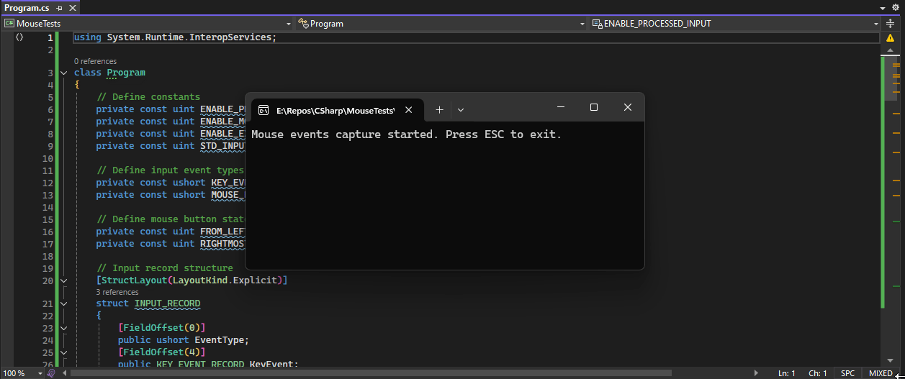

# MouseTests

This a test program to prove the mouse issue with `Windows Terminal` by not send mouse events when the mouse is outside at top of the WT, no mater I'm using win32-input-mode or using virtual terminal sequences. It only send events inside and outside left, bottom and right, but not when it's outside of the top window.

With the conhost this doesn't happens, so I imagine that it's only a WT issue. Thanks for your attention.